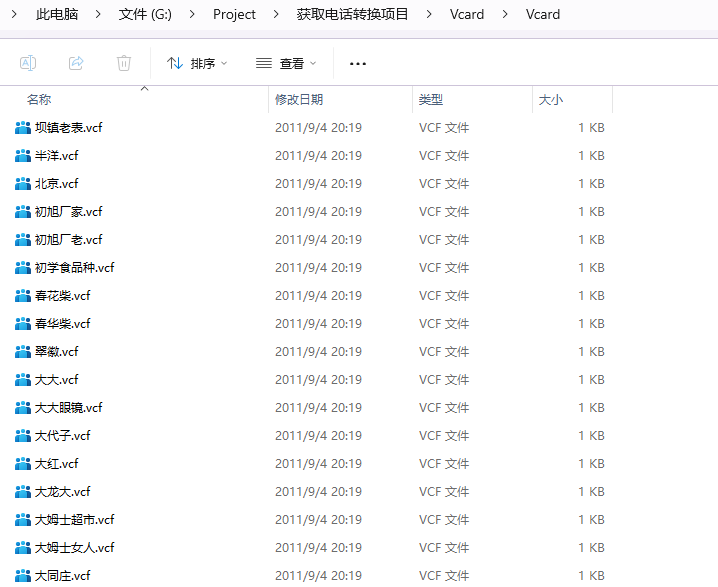
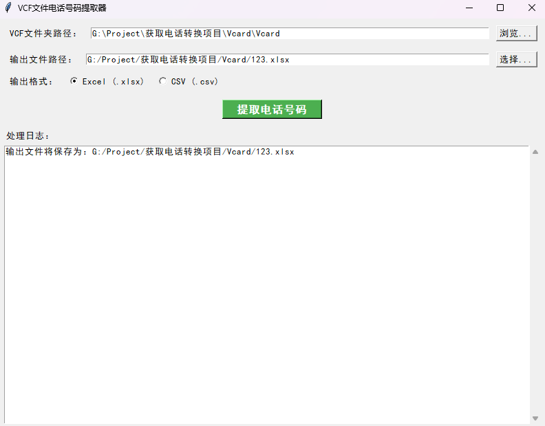
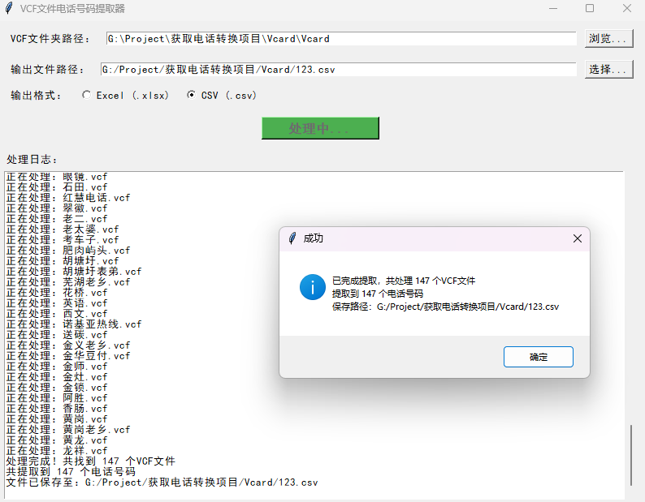
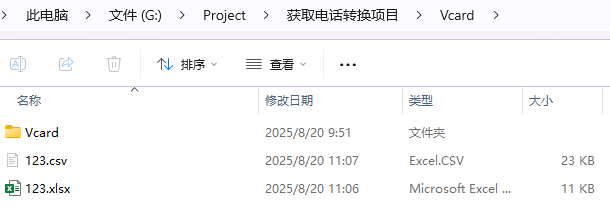

# 说明 
使用python处理大量vcf文件来整理并且表格化，主要采用格式标准提取内容关键词。

✨ **优点：**
*   python跨平台性
*   处理大量vcf电话文件为表格📦

# GUI 🚀

## 🛠️ 功能说明
### 布局
> 从上到下分别是要处理的VCF大量文件所在位置
> 输出文件位置选择
> 输出格式这里分别有Excel的xlsx格式与CSV格式
> 然后一键提取

### 🖨️ 打印提取效果如图

### 效果如图
细节部分就不透露了，涉及个人隐私等问题
